# Aluno Online — API REST Acadêmica

## 1. Visão geral do projeto

Este projeto é uma API REST desenvolvida com **Spring Boot** para o gerenciamento de um ecossistema acadêmico. A aplicação gerencia as seguintes entidades:

- **Aluno**
- **Professor**
- **Disciplina**
- **Matrícula**

A aplicação expõe operações de cadastro, consulta, atualização, remoção (CRUD) e regras de negócio acadêmicas, adotando uma organização em camadas típica de aplicações corporativas Java com **Spring Web + Spring Data JPA**, além do padrão **DTO (Data Transfer Object)** para comunicação externa segura.

## 2. Objetivo da aplicação

A API tem como finalidade disponibilizar endpoints HTTP para administrar o ambiente escolar, permitindo:

- Gerenciar cadastros de alunos e professores;
- Criar disciplinas e vinculá-las a professores responsáveis;
- Realizar matrículas de alunos em disciplinas;
- Trancar matrículas com validação de status;
- Lançar notas com cálculo automático de média e aprovação/reprovação;
- Emitir o histórico acadêmico completo do aluno.

Trata-se de uma API educacional completa, adequada para compreender o fluxo de dados relacional e a aplicação de regras de negócio no backend.

## 3. Tecnologias e componentes identificados

Com base na estrutura do projeto, foram identificadas as seguintes tecnologias:

- **Java 17+**
- **Spring Boot 3.x** (`@SpringBootApplication`)
- **Spring Web** (`@RestController`, `@RequestMapping`, mapeamentos HTTP)
- **Spring Data JPA** (`JpaRepository`, mapeamento ORM)
- **Jakarta Persistence / JPA** (`@Entity`, `@Table`, `@Id`, `@ManyToOne`)
- **PostgreSQL** (Banco de dados relacional definido via `application.properties`)
- **Lombok** (`@Data`, `@NoArgsConstructor`, `@AllArgsConstructor` para redução de boilerplate)

## 4. Estrutura lógica do projeto

A organização segue o pacote-base `br.com.alunoonline.api`, dividida nas seguintes responsabilidades:

```
br.com.alunoonline.api
├── controller/          # Endpoints REST
│   ├── AlunoController
│   ├── ProfessorController
│   ├── DisciplinaController
│   └── MatriculaAlunoController
├── service/             # Regras de negócio
│   ├── AlunoService
│   ├── ProfessorService
│   ├── DisciplinaService
│   └── MatriculaAlunoService
├── repository/          # Acesso a dados (JPA)
│   ├── AlunoRepository
│   ├── ProfessorRepository
│   ├── DisciplinaRepository
│   └── MatriculaAlunoRepository
├── model/               # Entidades JPA
│   ├── Aluno
│   ├── Professor
│   ├── Disciplina
│   └── MatriculaAluno
├── dtos/                # Objetos de transferência
│   ├── AtualizarNotaRequestDTO
│   ├── DisciplinasAlunoDto
│   └── HistoricoAlunoDto
└── MatriculaAlunoStatusEnum  # Enum de status
```

## 5. Descrição da arquitetura utilizada

### 5.1. Arquitetura em camadas

**a) Camada de apresentação (controller):** Recebe requisições HTTP, mapeia endpoints REST, desserializa JSON (via DTOs ou Models) e delega o processamento à camada de serviço.

**b) Camada de serviço (service):** Centraliza a lógica de aplicação. Valida status de matrículas, calcula médias de notas e atua como intermediária entre controller e repository.

**c) Camada de persistência (repository):** Responsável pelo acesso ao banco de dados PostgreSQL. Herdam de `JpaRepository`, fornecendo operações prontas de CRUD e consultas personalizadas.

**d) Camada de domínio (model e enums):** Representa as entidades persistidas no banco, com mapeamento JPA relacional (como `@ManyToOne`).

**e) Camada de transporte (dtos):** Objetos simples que transportam apenas os dados necessários entre o cliente (front-end/Insomnia) e o servidor, evitando exposição direta das entidades do banco.

### 5.2. Fluxo da requisição (Exemplo com DTO)

1. Cliente faz requisição HTTP enviando um JSON (`AtualizarNotaRequestDTO`).
2. Controller recebe a requisição e chama o Service.
3. Service processa as notas, calcula a média, altera o status (Enum) e delega ao Repository.
4. Repository atualiza a entidade `MatriculaAluno` no banco.
5. Resposta HTTP **204 NO CONTENT** retorna ao cliente.

## 6. Detalhamento do código

### 6.1. Classe principal

**ApiApplication:** Possui a anotação `@SpringBootApplication` e o método `main` para iniciar o contexto do Spring Boot.

### 6.2. Modelos de domínio (model)

- **Aluno:** Entidade base com `id`, `nomeCompleto`, `cpf` e `email`.
- **Professor:** Entidade base com `id`, `nomeCompleto`, `cpf` e `email`.
- **Disciplina:**
  - Campos: `id`, `nome`, `cargaHoraria`.
  - Relacionamento: `@ManyToOne` com Professor (uma disciplina pertence a um professor).
- **MatriculaAluno:**
  - Entidade central (tabela associativa).
  - Campos: `id`, `nota1`, `nota2`.
  - Relacionamentos: `@ManyToOne` com Aluno e `@ManyToOne` com Disciplina.
  - Possui um campo `status` baseado no Enum `MatriculaAlunoStatusEnum`.

### 6.3. Enums e DTOs

- **MatriculaAlunoStatusEnum:** Define os estados possíveis: `MATRICULADO`, `APROVADO`, `REPROVADO`, `TRANCADO`, `DESLIGADO`.
- **AtualizarNotaRequestDTO:** Recebe apenas `nota1` e `nota2` do cliente.
- **DisciplinasAlunoDto:** Estrutura de saída para listar as matérias (nome da disciplina, professor, notas, média e status).
- **HistoricoAlunoDto:** Estrutura "envelope" que junta os dados do aluno (`nomeAluno`, `cursoAluno`) com uma lista de `DisciplinasAlunoDto`.

### 6.4. Camada de serviço (service)

- **AlunoService** e **ProfessorService:** Gerenciam os CRUDs completos (salvar, listar todos, buscar por ID, excluir por ID e atualizar por ID).
- **DisciplinaService:** Salva disciplinas vinculando-as aos professores.
- **MatriculaAlunoService** (contém as principais regras de negócio):
  - `criarMatricula`: Associa aluno e disciplina, definindo o status inicial como `MATRICULADO`.
  - `trancarMatricula`: Busca a matrícula e altera o status para `TRANCADO`.

### 6.5. Repositórios (repository)

Além dos CRUDs automáticos de `JpaRepository` para Aluno, Professor e Disciplina, o `MatriculaAlunoRepository` contém o método de busca personalizada:

- `findByAlunoId(long alunoId)`: Retorna uma lista de matrículas de um aluno específico (usado para gerar o histórico).

## 7. Resumo dos endpoints

### Alunos (`/alunos`)

| Método | Endpoint | Descrição | Status esperado |
|--------|----------|-----------|-----------------|
| `POST` | `/alunos` | Criar aluno | 201 |
| `GET` | `/alunos` | Listar todos os alunos | 200 |
| `GET` | `/alunos/{id}` | Buscar aluno por ID | 200 |
| `PUT` | `/alunos/{id}` | Atualizar aluno por ID | 204 |
| `DELETE` | `/alunos/{id}` | Excluir aluno por ID | 204 |

### Professores (`/professores`)

| Método | Endpoint | Descrição | Status esperado |
|--------|----------|-----------|-----------------|
| `POST` | `/professores` | Criar professor | 201 |
| `GET` | `/professores` | Listar todos os professores | 200 |
| `GET` | `/professores/{id}` | Buscar professor por ID | 200 |
| `PUT` | `/professores/{id}` | Atualizar professor por ID | 204 |
| `DELETE` | `/professores/{id}` | Excluir professor por ID | 204 |

### Disciplinas (`/disciplinas`)

| Método | Endpoint | Descrição | Status esperado |
|--------|----------|-----------|-----------------|
| `POST` | `/disciplinas` | Cadastrar nova disciplina | 201 |

### Matrículas (`/matriculas`)

| Método | Endpoint | Descrição | Status esperado |
|--------|----------|-----------|-----------------|
| `POST` | `/matriculas` | Matricular aluno na disciplina | 201 |
| `POST` | `/matriculas/trancar/{id}` | Trancar matrícula | 204 |

## 8. Prints de testes — Banco de Dados (DBeaver)

### Tabela `alunos`
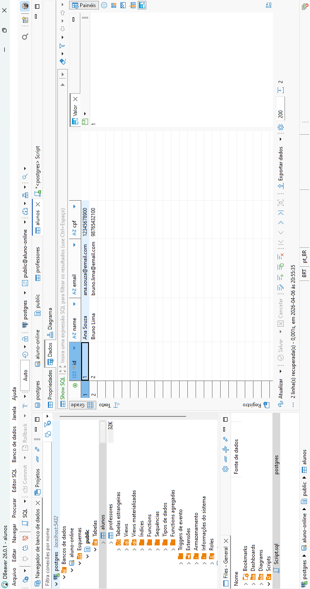

### Tabela `professores`
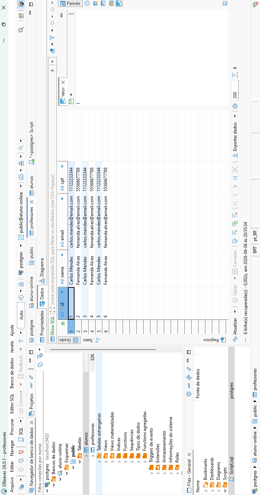

## 9. Prints de testes — Insomnia

### CRUD de Alunos

**Criar Aluno** (`POST /alunos`) — Status `201 Created`
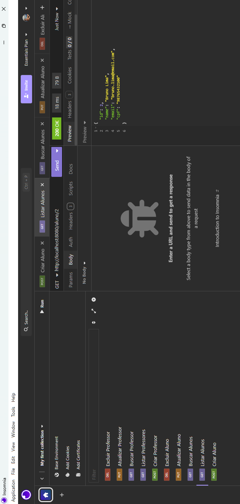

**Listar Alunos** (`GET /alunos`) — Status `200 OK`
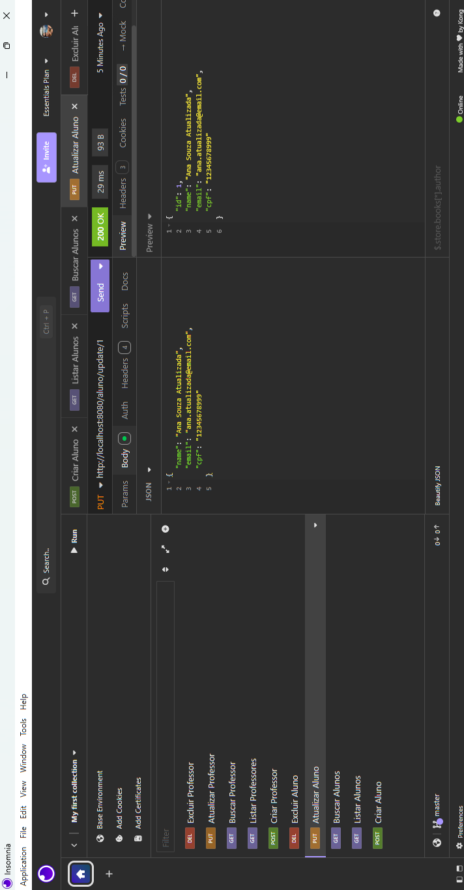

**Buscar Aluno por ID** (`GET /alunos/{id}`) — Status `200 OK`
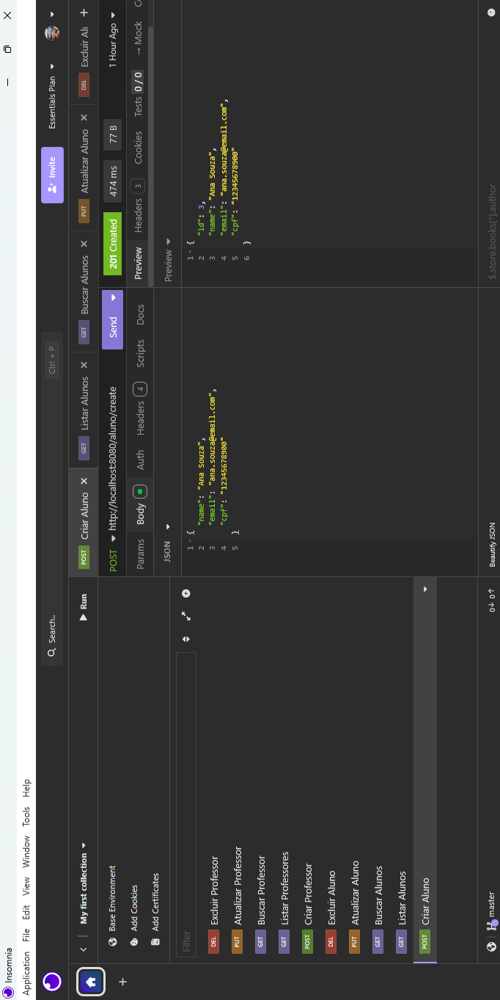

**Atualizar Aluno** (`PUT /alunos/{id}`) — Status `200 OK`
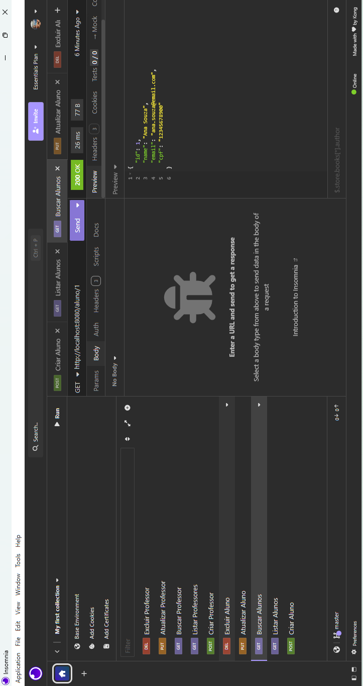

**Excluir Aluno** (`DELETE /alunos/{id}`) — Status `204 No Content`
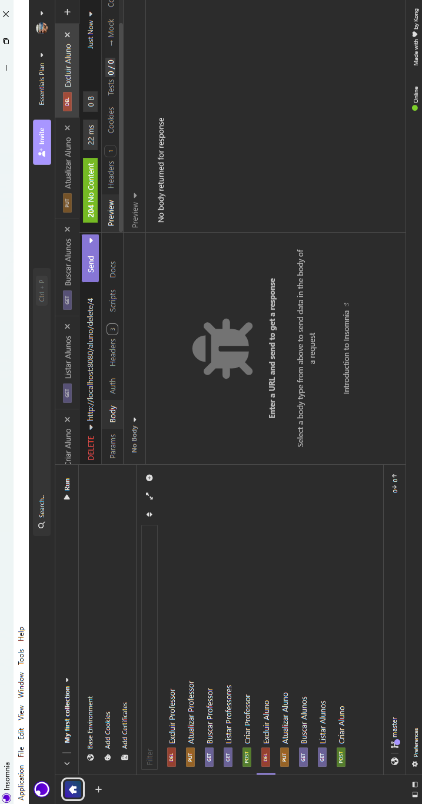

### CRUD de Professores

**Criar Professor** (`POST /professores`) — Status `201 Created`
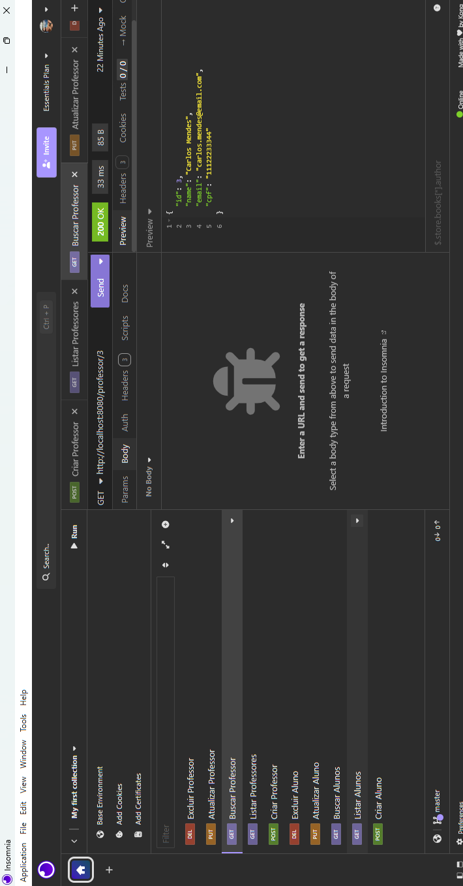

**Listar Professores** (`GET /professores`) — Status `200 OK`
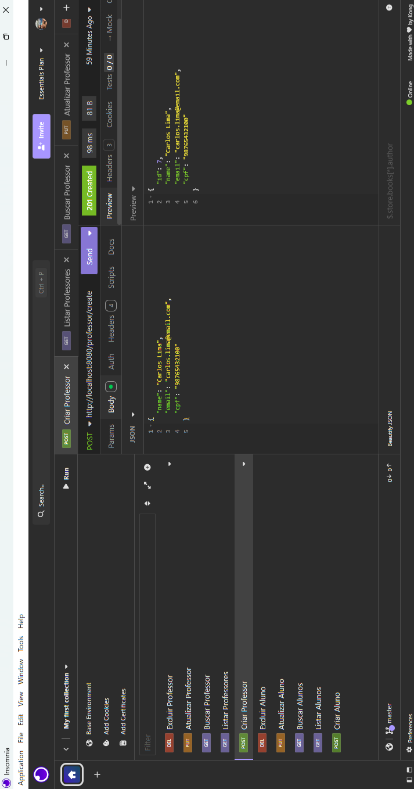

**Buscar Professor por ID** (`GET /professores/{id}`) — Status `200 OK`
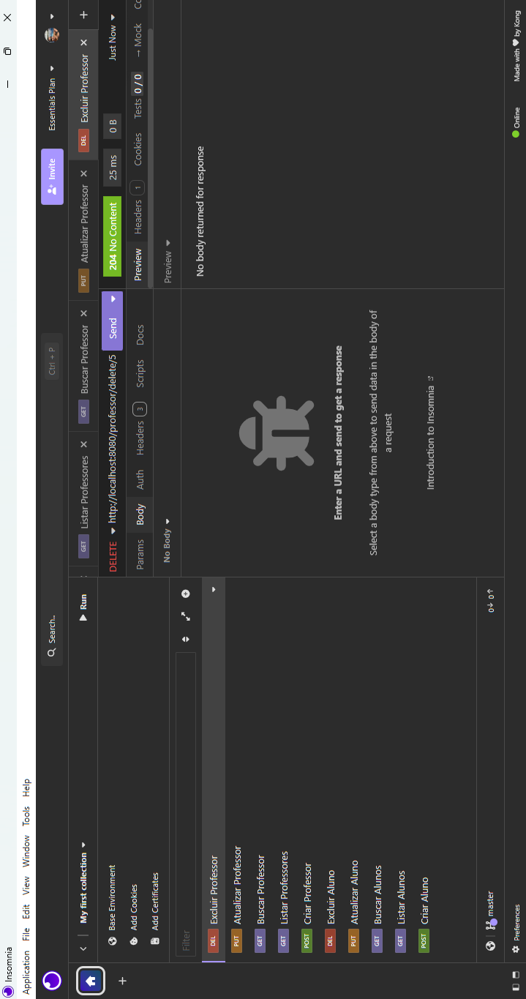

**Atualizar Professor** (`PUT /professores/{id}`) — Status `200 OK`
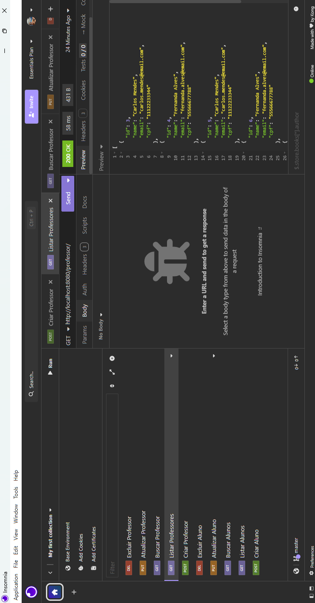

**Excluir Professor** (`DELETE /professores/{id}`) — Status `204 No Content`
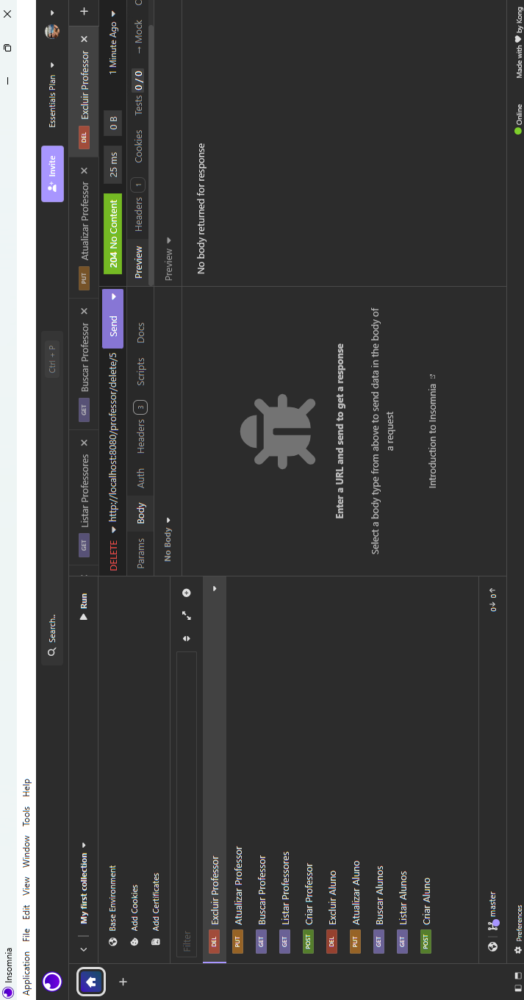

## 10. Exemplos de payload JSON

**Cadastrar Aluno** (`POST /alunos`)
```json
{
  "nomeCompleto": "Maria da Silva",
  "cpf": "12345678900",
  "email": "maria@email.com"
}
```

**Cadastrar Professor** (`POST /professores`)
```json
{
  "nomeCompleto": "João Pereira",
  "cpf": "98765432100",
  "email": "joao.pereira@email.com"
}
```

**Cadastrar Disciplina** (`POST /disciplinas`)
```json
{
  "nome": "Backend com Java",
  "cargaHoraria": 80,
  "professor": {
    "id": 1
  }
}
```

**Criar Matrícula** (`POST /matriculas`)
```json
{
  "aluno": { "id": 1 },
  "disciplina": { "id": 1 }
}
```

**Atualizar Notas**
```json
{
  "nota1": 8.5,
  "nota2": 7.0
}
```

**Exemplo de Histórico (Response)**
```json
{
  "nomeAluno": "Maria da Silva",
  "cursoAluno": "Ciência da Computação",
  "disciplinasAlunoList": [
    {
      "nomeDisciplina": "Backend com Java",
      "professorDisciplina": "João Pereira",
      "nota1": 8.5,
      "nota2": 7.0,
      "media": 7.75,
      "status": "APROVADO"
    }
  ]
}
```

## 11. Características arquiteturais observadas

### Pontos positivos

- Separação clara de responsabilidades nas camadas (controller → service → repository);
- Uso do padrão DTO para emitir relatórios (Histórico) e receber dados parciais (Notas);
- Lógica de negócio isolada corretamente na camada Service (evitando "Fat Controllers");
- Relacionamentos JPA (`@ManyToOne`) bem estruturados;
- CRUD completo para Aluno e Professor com todos os verbos HTTP (`POST`, `GET`, `PUT`, `DELETE`).

### Pontos de melhoria

- Incluir validações de entrada (`@Valid`, `@NotBlank`, `@NotNull`) nos DTOs e Models;
- Implementar um `GlobalExceptionHandler` (`@ControllerAdvice`) para padronizar os retornos de erro (ex: aluno não encontrado);
- Paginação (`Pageable`) nos endpoints de listagem GET;
- Adicionar endpoints de atualização de notas e emissão de histórico no controller de matrículas.

## 12. Exemplo de arquitetura conceitual

```
┌─────────────────────────┐
│       Cliente HTTP       │
│  (Insomnia / Frontend)   │
└────────────┬────────────┘
             │ JSON (DTOs)
             ▼
┌─────────────────────────┐
│       Controllers        │
│ Aluno, Prof, Disc, Matr  │
└────────────┬────────────┘
             │ Delega fluxo
             ▼
┌─────────────────────────┐
│        Services          │
│  Regras (Cálculo Notas)  │
└────────────┬────────────┘
             │ Usa Models
             ▼
┌─────────────────────────┐
│      Repositories        │
│      JpaRepository       │
└────────────┬────────────┘
             │ SQL (JPA)
             ▼
┌─────────────────────────┐
│     Banco de Dados       │
│  PostgreSQL (4 Tabelas)  │
└─────────────────────────┘
```

## 13. Arquivos analisados para esta documentação

- `ApiApplication.java`
- **Pacote controller:** AlunoController, ProfessorController, DisciplinaController, MatriculaAlunoController
- **Pacote service:** AlunoService, ProfessorService, DisciplinaService
- **Pacote repository:** AlunoRepository, ProfessorRepository, DisciplinaRepository, MatriculaAlunoRepository
- **Pacote model:** Aluno, Professor, Disciplina, MatriculaAluno
- **Pacote dtos:** AtualizarNotaRequestDTO, DisciplinasAlunoDto, HistoricoAlunoDto
- **Enum:** MatriculaAlunoStatusEnum
